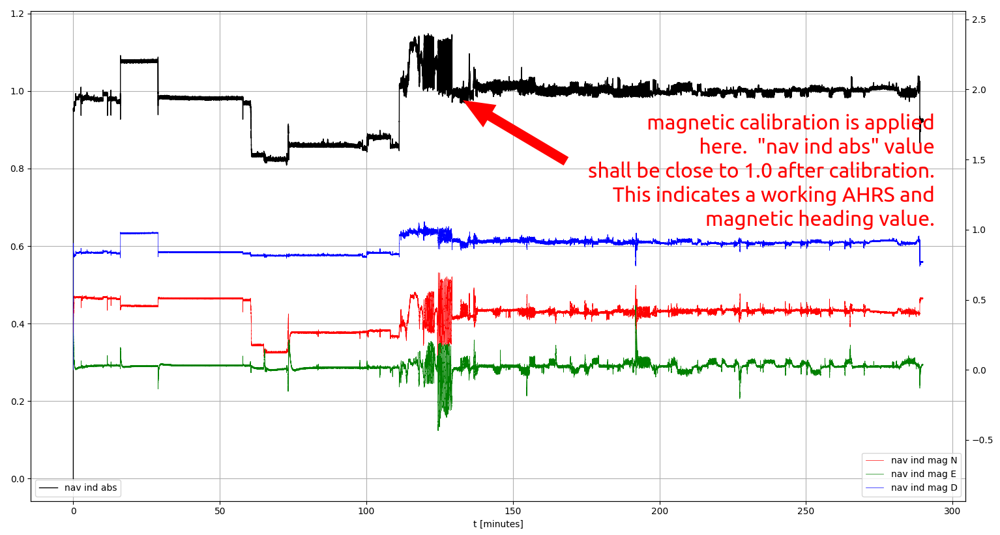
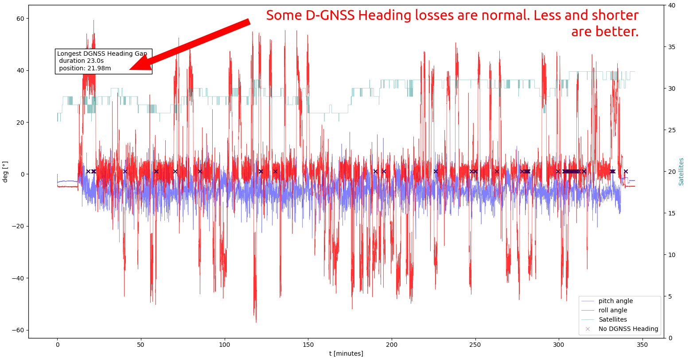
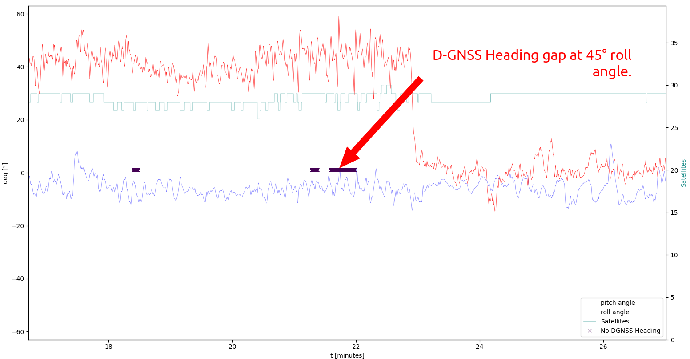
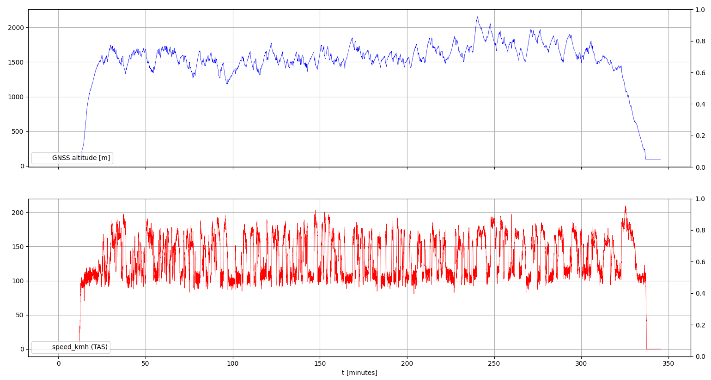

# Analysis
- Tool to analyse binary Larus sensor data. 
- Reading the data into a Python Pandas Dataframe for the data scientists
- analysis_plots.py: A tool to plot some significant figures to evaluation the Larus sensor data quality

## How to start
You need a measurement data record file from a Larus sensor (*.f37) which contains the non-processed raw sensor 
measurement values (ACC, GYRO, MAG, (D-)GNSS, Static, Pitot) and the corresponding configuration (*.EEPROM) file.
Both files are recorded during operation if logging is enabled. https://github.com/larus-breeze/sw_sensor

## analysis_plots.py 
Can be used to load a *.f37 file. It offers the options to plot significant figures. These plots can be used to analyse
the performance of a Larus sensor installation. It might be helpful to optimize the installation. 

### Induction in earth system
The following figure shows induction values in the earth coordinate system. A Larus sensor 
converts the x y z mag values from the plane coordinate system into the earth coordinate system 
using an AHRS rotation matrix. The plot show data from a sensor on its first flight. There is 
no prior magnetic calibration. The sensor continuously collects data during circling left and right. 
Once there is enough information to identify magnetic calibration parameters they are applied. 
The sensor continues to find optimized calibration parameters and applies them accordingly.
The right half of the figure shows the magnetic values with the applied calibration parameters. 
Ideally the plotted lines are "very" straight and only change with the declination and inclination
of the global magnetic field. The sensor from the here shown data is installed between other 
instruments in the panel. This is not optimal but still usable.   

### D-GNSS and AHRS
AHRS and GNSS status are shown below. Then plot is intended to identify possible GNSS problems and 
related differential GNSS Heading (D-GNSS) losses. GNSS position and speed signals are very stable 
and complete signal losses (no-fix) are quite rare. On the other side D-GNSS fixes are quite 
fragile. Some short interruptions, during dynamic flight situations are expected and compensated 
by automatically switching to the magnetic compass signal. Longer continuous losses can indicate 
a problematic antenna installation. 

#### D-GNSS heading status zoomed

### TAS and Altitude
The following can be used to check if the TAS and altitude signal is plausible.

## TODOs:
- Add an info pop up widget and show:  github.com/larus-breeze and a program name 